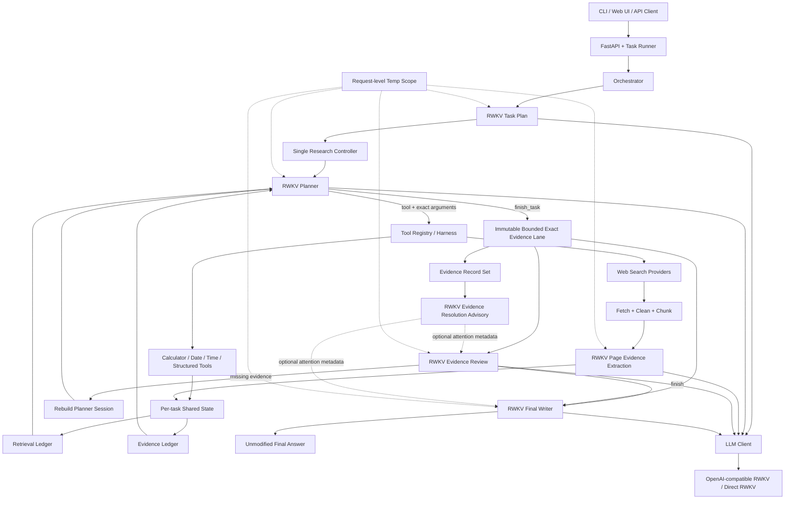

# RWKV-Scout

RWKV-Scout 是一个以 RWKV 为决策核心的联网检索 Agent。它面向需要实时网页、官方资料、结构化数据和多来源核验的问题：RWKV 负责拆解任务、选择工具与查询、判断是否需要继续检索，以及生成最终回答；工程层负责稳定执行工具、抓取和清洗网页、分块提取证据、隔离并发状态、记录 trace 与控制资源。

当前版本定位为**可运行、可审计的公开 Beta**。单轮检索 Agent 的主链路、并发控制、request-level temperature、网页证据抽取、Evidence Review 和前后端均已实现；它不是通用长程任务执行器，长任务持久化、断点恢复和 Task Graph 属于独立项目。

## 设计边界

- RWKV 拥有任务计划、工具、查询、来源、replan 和最终文本的决策权。
- Controller 执行模型选择的动作，不用规则替换检索路线，也不改写最终回答。
- Evidence Ledger 和 Retrieval Ledger 用于整理共享证据与避免完全重复的请求，不作为算法拒答门禁。
- 页面层允许确定性的抓取、正文清洗、结构解析和有限候选补偿，但最终事实选择与表达仍由 RWKV 完成。
- 生产链路返回模型输出；`pass` / `no-pass` 只属于离线评测，不参与用户回答。

## 当前架构

下图根据当前代码入口和实际调用关系整理：



### 核心组件

| 组件 | 主要文件 | 职责 |
| --- | --- | --- |
| API 与任务生命周期 | `api.py`, `app/services/task_runner.py` | 创建后台任务、隔离请求配置、记录历史、暴露 health/readiness/metrics |
| Orchestrator | `agent/orchestrator.py` | 初始化单任务状态、调用 RWKV 任务规划、启动研究循环、构造最终证据上下文 |
| Planner / Plan Revision | `agent/planner.py` | 由 RWKV 生成 Task Record、选择下一工具调用、审查证据、在需要时重建 Planner 会话 |
| 单一研究循环 | `agent/unified_research.py` | 执行模型动作、反馈工具结果、冻结完全重复路径、连接 replan 和最终写作 |
| 工具 Harness | `tools/registry.py`, `tools/builtin.py` | 暴露确定性的参数协议和工具目录；不替 RWKV 选择路线 |
| 搜索与网页管线 | `tools/web_search_generic.py`, `agent/page_evidence.py` | 并发搜索、抓取、正文清洗、分块、RWKV 证据抽取和有限结构化补偿 |
| 任务状态与账本 | `agent/state.py`, `agent/evidence_ledger.py`, `utils/retrieval_ledger.py` | 保存本任务的 query、URL、证据记录、重复请求、Plan Revision 和冻结路径 |
| 最终写作 | `agent/retrieval_synthesis.py` | 在 16K 上下文预算内选择证据并请求 RWKV 写作，返回原始模型文本 |
| 模型运行时 | `clients/llm_client.py`, `runtime/compat.py`, `runtime/direct_rwkv.py` | 连接 OpenAI-compatible `/v1` 服务或直接 RWKV runtime，传播采样配置 |
| Trace 与资源控制 | `utils/task_events.py`, `utils/runtime_gate.py`, `utils/time_budget.py` | 记录模型输入/输出、工具调用、温度和错误；限制并发与单任务时长 |

### 一次请求如何执行

1. API 或 CLI 创建独立 `AgentState`。
2. RWKV 生成任务计划；工程层不通过 Intake 规则改写计划。
3. RWKV 在单一循环中逐步选择工具、查询、URL 和参数。
4. 搜索结果被抓取、清洗和分块；页面证据抽取结果写入本任务的共享状态。
5. RWKV 请求 `finish_task` 时，系统先构造一次不可变的有界 exact evidence lane；Evidence Resolution 只能通过独立参数附加可选注意力映射，不能删除、替换、筛选、重排或混入其中的材料。独立的 RWKV Evidence Review 再判断是写答案还是重新规划。
6. 若需要补证据，系统保留账本、重建 planner 会话，再由 RWKV 选择新路径。
7. 只有绑定当前 evidence digest 的有效 RWKV `finish` 才能启动 Writer；Review 缺失、协议错误或旧的 `replan` 不会被解释成隐式完成。检索资源耗尽时会发起一次独立的终端 Review，该请求只允许 RWKV 显式选择 `write_answer`，让 Writer 基于已保留证据回答可支持部分并说明缺失信息。Writer 接收同一份不可变 evidence lane 和独立 advisory metadata 后生成回答；代码不根据 Resolution 改变证据，也不删句、不改写、不做摘录替代。

## Temp 机制

这里的 `temp` 指模型请求中的 `temperature`。它的目标**不是简单提高随机性**，而是让不同请求、不同推理阶段选择适合的生成行为：事实提取和最终写作倾向稳定，检索策略和 replanning 允许更多探索。

### 当前策略

| 阶段 | 当前默认值 | 行为 |
| --- | ---: | --- |
| Task Plan | `0.1` | 稳定生成结构化事实记录 |
| Planner tool decision | `0.1` | 保持工具 JSON 稳定，同时允许少量搜索策略变化 |
| Plan Revision | `0.3`，冲突/升级边界最高 `0.4` | 在旧路径不足时扩大搜索策略空间 |
| Evidence Review | `0.1` | 稳定输出 `write_answer` / `continue_retrieval` 结构 |
| Evidence Resolution | `0.1` | 稳定输出字段与 Evidence Record 的映射 |
| Page Evidence | `0.3` | 降低复读并抽取可回定位 span |
| Final Writer | `0.1` | 从最终证据包生成事实回答 |

阶段值位于 `config.json` 的 `MODEL_RUNTIME.sampling`。全局默认值来自当前 provider 的 `temperature`，可用 `RWKV_ECRA_LLM_TEMPERATURE` 覆盖。

### 完整调用链

```text
Planner / Evidence Review stage
  -> get_model_stage_temperature(stage)
  -> Plan Revision 可调用 get_model_replan_temperature(generation)
  -> model_sampling_parameters(temp, optional seed)
  -> request-local ContextVar
  -> LLMClient
  -> runtime/compat.py 或 runtime/direct_rwkv.py
  -> 当前请求 payload.temperature
  -> 推理服务
```

`ContextVar` 的作用是隔离并发任务：一个任务的 replanner 即使临时使用 `0.45`，也不会把另一个任务的提取或最终回答改成同一温度。scope 退出后会自动恢复原值。

OpenAI-compatible runtime 会在每个 `/chat/completions` 或 `/completions` 请求中读取当前温度并写入 payload。Plan Revision 使用独立的 request-level sampling profile；其他阶段默认不发送 seed。Direct RWKV runtime 同样逐请求读取当前温度。

### Request-level temp 与全局固定 temp

- 全局固定 temp：进程启动后所有请求共享一个值，无法区分规划、提取、验证和写作。
- Request-level temp：每次模型调用都能独立选择值，并且并发隔离；这是当前 Planner、Plan Revision 和 Evidence Review 已采用的方式。
- 全局值仍作为未显式分类阶段的 fallback；当前核心模型阶段均已有独立 stage policy。
- Planner 和 Evidence Review 事件会记录 `sampling_temperature`、可选 `sampling_seed`、prompt 与模型输出，方便分析温度与结果的关系；并非所有模型请求都已记录独立的策略原因。

## 并发模型

并发分成互不混用的层级：

- 跨任务并发：实验默认最多 4 个案例；每个案例拥有独立状态。
- 搜索 provider 与网页抓取：网络 I/O 并发，并有单 host 限制。
- 页面证据抽取：使用独立 chunk lane，并限制单任务占用的模型槽。
- Planner、Evidence Resolution、Evidence Review 和最终写作：保留 control slots，避免被大量 chunk 请求挤占。

共享状态只在**同一个任务内部**共享。不同用户或不同测试题不会共享证据、Task Record、Planner transcript 或 temp scope。

## 环境要求

- Linux 或 WSL2
- Python 3.10+
- [uv](https://docs.astral.sh/uv/)
- Node.js 20.19+（仅前端需要）
- OpenAI-compatible RWKV 服务，或能够直接加载的本地 RWKV checkpoint

## 安装与配置

安装 Python 依赖和开发测试依赖：

```bash
uv sync --dev
```

创建本地配置。`.env.local` 会在 `config.py` 导入时自动加载，并且不会覆盖进程中已经设置的环境变量：

```bash
cp .env.example .env.local
chmod 600 .env.local
```

至少配置以下项目：

```bash
RWKV_ECRA_LLM_BASE_URL=http://127.0.0.1:29613/v1
RWKV_ECRA_LLM_API_KEY=replace-with-local-api-key
RWKV_ECRA_LLM_MODEL=rwkv7-g1i-13.3b-20260805-ctx16384
RWKV_ECRA_LLM_CONTEXT_LENGTH=16384
```

若页面提取端使用不同凭证，可设置 `RWKV_ECRA_SLM_PASSWORD`；未设置时复用 `RWKV_ECRA_LLM_API_KEY`。

搜索 provider 是可选的：

```bash
TAVILY_API_KEY=replace-with-your-key
TAVILY_API_KEYS=["key-1","key-2"]
RWKV_ECRA_WIGOLO_MODE=auto
WIGOLO_BASE_URL=http://127.0.0.1:3333
```

没有 Tavily key 时仍可使用无 key provider；本地 [wigolo](https://github.com/KnockOutEZ/wigolo) 也可作为搜索后端。不要把真实 key 写入 `config.json`、`.env.example` 或任何 benchmark 文件。

### Direct RWKV runtime

默认 backend 是 `openai_compat`。若改为 `direct_rwkv`，需要自行准备 vllm-rwkv 源码、checkpoint 和词表路径：

```bash
RWKV_ECRA_RWKV_ENGINE_ROOT=/path/to/vllm-rwkv
RWKV_ECRA_RWKV_MODEL_PATH=/path/to/model.pth
RWKV_ECRA_RWKV_VOCAB_PATH=/path/to/rwkv_vocab_v20230424.txt
RWKV_ECRA_RWKV_DEVICE=cuda
```

模型权重和外部推理引擎不属于本仓库，也不会上传 GitHub。

## 运行

命令行单次执行：

```bash
uv run python main.py "查询 Python 3.13.0 的正式发布日期并给出官方来源"
```

启动 API：

```bash
uv run rwkv-ecra-api
```

默认地址为 `http://127.0.0.1:8787`。可用 `RWKV_ECRA_API_HOST`、`RWKV_ECRA_API_PORT`、`RWKV_ECRA_API_WORKERS` 覆盖。

启动前端：

```bash
cd frontend
npm ci
npm run dev
```

默认前端地址为 `http://127.0.0.1:5177`。

## 验证与常用命令

Python 测试：

```bash
uv run pytest -q
```

前端可复现构建：

```bash
cd frontend
npm ci
npm run build
```

不要求模型在线的预检：

```bash
uv run rwkv-ecra-preflight \
  --dataset data/evaluation/preflight_smoke_10.jsonl \
  --allow-model-down
```

模型服务在线时执行完整 readiness 预检：

```bash
uv run rwkv-ecra-preflight \
  --dataset data/evaluation/preflight_smoke_10.jsonl
```

服务启动后：

```bash
curl http://127.0.0.1:8787/healthz
curl http://127.0.0.1:8787/readyz
curl http://127.0.0.1:8787/api/v1/metrics/operational
curl http://127.0.0.1:8787/metrics
```

仓库保留了 172 题拆分集、40 题随机/干扰集和 100 题强制检索集作为回归输入。生成的回答、trace、日志和 audit 位于本地 `outputs/`、`data/output/` 或 `logs/`，不会提交。

## 从 GitHub 恢复

下面的流程只依赖仓库文件、你自己的模型服务和私密配置：

```bash
git clone git@github.com:w1c2j3/RWKV-Scout.git
cd RWKV-Scout
git switch chase/retrieval-agent

uv sync --frozen --dev
cp .env.example .env.local
chmod 600 .env.local
```

编辑 `.env.local`，填入自己的 RWKV endpoint、model、context length 和本地 API key；需要 Tavily 或 wigolo 时再添加对应配置。然后执行：

```bash
uv run pytest -q
uv run rwkv-ecra-preflight \
  --dataset data/evaluation/preflight_smoke_10.jsonl \
  --allow-model-down

cd frontend
npm ci
npm run build
cd ..
```

启动 RWKV 推理服务后：

```bash
uv run rwkv-ecra-preflight \
  --dataset data/evaluation/preflight_smoke_10.jsonl
uv run rwkv-ecra-api
```

`data/input/`、`data/output/`、checkpoint、asset 和日志目录会按需创建。恢复不需要本机原有 `.env.local`、缓存、生成输出或旧 benchmark 运行目录。

## 当前限制

- 高时效问题仍可能把过期官方页面当作当前状态，freshness 与实体/版本绑定仍需加强。
- Replanner 在重复检索场景可能重建过多，增加延迟和超时概率。
- 交叉验证输入在极端证据量下仍可能接近上下文上限。
- 本地推理端长时间无响应时，部分 Python 级 timeout 无法立即终止底层请求。
- RWKV 偶尔产生重复长输出；项目不会用规则直接修改最终文本。
- 当前状态主要保存在一次任务的内存和 trace 中，不支持通用长程任务的可靠中断恢复。
- 本地积累大量历史 trace 后，operational metrics 的首次全量聚合可能超过 10 秒。

这些限制会记录在执行 trace 中。当前归档代表可用 Beta，而不是对所有联网问题正确率或无超时的承诺。

## 相关文档

- `ARCHITECTURE.md`：早期架构演进记录；以本 README 的“当前架构”为归档版本事实来源。
- `docs/MODEL_RUNTIME.zh-CN.md`：模型运行时与部署背景。
- `docs/EXPERIMENTS.md`：实验工具和评测流程。
- `docs/ARCHITECTURE_HANDOFF.zh-CN.md`：历史架构交接记录。
