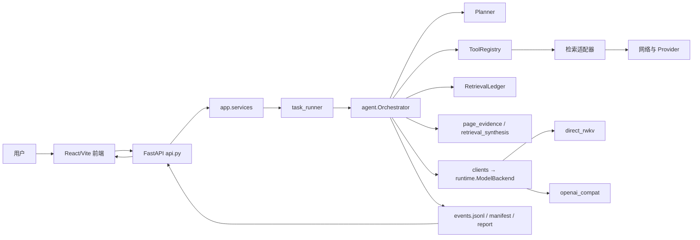
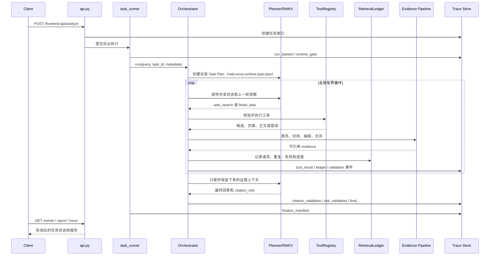
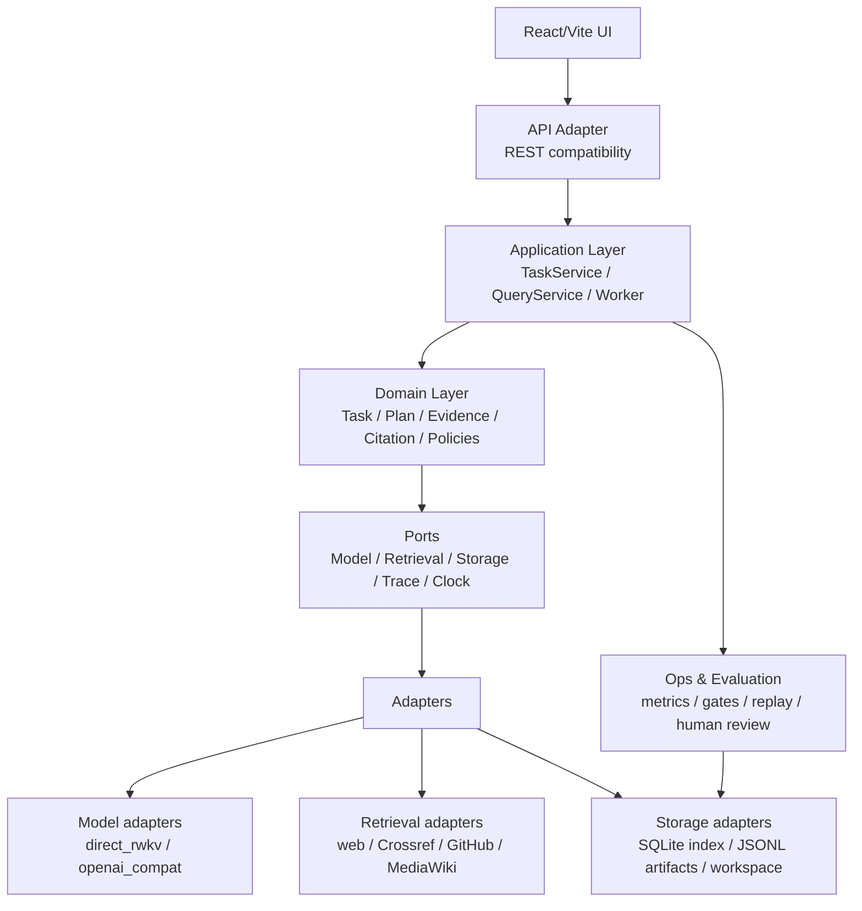

# RWKV-Scout 架构交接与目标架构

> 文档状态：架构交接稿（2026-08-04）
> 代码依据：当前工作区 `c85927b` 及其之后可见的工作区评测资料
> 适用对象：第一次接手项目、需要评审架构或准备继续重构的人

## 0. 先看结论

RWKV-Scout 不是一个普通的聊天机器人，而是一个面向长文本研究和网页取证的、可回放的 Agent 工作台。它的核心价值链是：

```text
用户问题
  → 任务计划
  → 有界检索循环
  → 正文级证据
  → 带来源回答
  → 事件轨迹、报告和评测结果
```

当前实现已经形成了一个“模块化单体 + 文件型可审计轨迹”的形态。生产检索主链路已经选择了单一共享循环：多个任务要点共享一个 Planner、一个 `RetrievalLedger`、一个证据集合和一个全局步数预算；并不是每个要点都启动一个独立 Agent。

我的建议是：继续保留模块化单体和单一共享循环，不要立即拆成微服务；先把编排、证据、任务生命周期和评测合同拆清楚。当前最需要解决的不是增加更多模型或更多工具，而是：

1. 修复证据入口质量：正文可用率、重复片段率、重要信息截断率仍然是主要瓶颈。
2. 拆分超大编排模块：`agent/orchestrator.py`、`agent/retrieval_synthesis.py` 已经承担过多职责。
3. 把长任务从 FastAPI `BackgroundTasks` 提升为可恢复的任务执行器。
4. 先完成真人参考答案、盲测和同模型重复实验，再决定候选方案是否上线。
5. 立即轮换仓库配置中已经出现过的搜索/API 凭据，并改成环境变量注入。

本文中的“当前架构”是代码事实；“目标架构”是建议的落地设计，不能把目标设计误认为已经完成的实现。

---

## 1. 项目是什么

### 1.1 产品定位

项目面向 RWKV 研究者和需要处理长文本材料的技术型用户，提供：

- 本地文件上传、读取、分块和长文档压缩；
- 外部网页和结构化资源检索；
- 正文级证据抽取、来源权威判断、引用校验；
- 本地 RWKV 或兼容 HTTP 服务的模型运行时；
- 可停止、可回看、可回放的研究任务；
- 可重复实验、盲评、参考答案门禁和运行指标。

### 1.2 不应该误解成什么

- 不是“让 LLM 自由调用一堆搜索 API”；生产模型可见面目前收敛为 `web_search` 和 `finish_task`，供应商选择、抓取、正文清洗、分块和证据合并由后端负责。
- 不是“搜索摘要直接生成答案”；搜索结果只是候选资源，最终回答应来自保留下来的正文或结构化证据。
- 不是“多个 Agent 并行后拼答案”；当前生产路径是一个共享状态的有界循环，逻辑任务要点是清单，不是独立进程。
- 不是“只要接口能返回 200 就算完成”；评测门禁要求轨迹、来源、引用、风险、人工参考答案和稳定性共同通过。

---

## 2. 当前架构（As-Is）

### 2.1 当前目录职责

```text
api.py                         HTTP 路由、兼容响应、健康检查
app/
  models.py                    API/任务传输模型
  services/task_runner.py     后台任务生命周期、运行时覆盖、超时和并发门禁
  services/workspace_files.py 工作区路径校验、文件读写、报告读取

agent/
  orchestrator.py             任务编排、检索循环、恢复、验证、最终合成
  planner.py                  任务计划和下一步模型动作解析
  state.py                    单任务状态和上下文投影
  retrieval_loop.py           查询候选、检索结果合并、去重、排序
  page_evidence.py            单页面正文切分和候选事实抽取
  retrieval_synthesis.py     证据上下文构建、最终回答、修复和验证
  analyzer.py                 模型分析入口
  slm_scheduler.py            可选的本地 SLM 批量调度

tools/
  registry.py / builtin.py    工具注册、权限、阶段和执行入口
  *_search.py                 Crossref、GitHub、MediaWiki、网页等适配器

clients/
  llm_client.py               LLM 统一调用入口
  slm_client.py               SLM 调用和批处理

runtime/
  backend.py                  模型后端协议和响应模型
  factory.py                  后端选择和缓存
  direct_rwkv.py              直接加载 RWKV checkpoint
  compat.py                   OpenAI-compatible HTTP 过渡适配器

workflows/
  map_reduce_flow.py          本地长文档 SLM Map/Reduce
  memory_query_flow.py        对原始文件进行细节查询
  report_flow.py              文件报告生成

utils/
  retrieval_ledger.py          检索请求、重复、失败和进度账本
  task_manager.py              文件型任务索引和状态
  task_events.py              任务事件 JSONL
  experiment_manifest.py      运行清单、配置快照和回放合同
  citation_validator.py       引用 URL、证据和 locator 校验
  source_authority.py         来源权威策略
  runtime_gate.py              跨线程/跨进程并发租约
  ...                          配置、网络、分块、指标、评测和安全策略

frontend/
  src/App.jsx                 前端主状态、轮询、任务操作和页面编排
  src/api.js                  前端 API 客户端和响应转换
  src/components/             任务、事件、验收和报告组件
```

### 2.2 当前系统上下文



### 2.3 一次研究任务的实际执行链



### 2.4 当前模块之间的边界

当前约定的依赖方向是：

```text
HTTP routes → app services → agent/workflows → tools/clients → utils
```

这个方向总体正确，尤其是两点已经做对：

- 模型调用不再散落在业务流程中，而是通过 `runtime.ModelBackend` 统一隔离；
- 检索工具不应把网页内容当成系统指令，也不应直接修改用户文件。

但实际代码仍存在“边界名义上存在、职责内部仍然耦合”的问题：

| 区域 | 当前事实 | 主要问题 |
| --- | --- | --- |
| `api.py` | 路由、任务创建、历史恢复、指标和兼容路径都集中在一个文件 | API 层仍知道太多持久化和任务状态细节 |
| `task_runner.py` | 负责上下文覆盖、超时、租约、调用 Orchestrator、收尾和异常 | 任务应用服务、执行器和运行策略未分离 |
| `orchestrator.py` | 同时负责计划、循环、工具执行、恢复、证据评审、最终合成、验证和报告 | 1872 行，修改一处容易影响整条链路 |
| `planner.py` | 同时负责计划生成、协议修复、工具动作解析、上下文裁剪、replan | 计划合同和模型输出容错混在一起 |
| `retrieval_synthesis.py` | 同时负责证据选择、上下文打包、最终回答、回答修复和质量判断 | 2156 行，证据层和回答层难以单测隔离 |
| `workflows/*` | 本地文档 Map/Reduce 与网页研究主链路并存，并通过 ToolRegistry 接入 | 两个领域边界不够明确，容易互相污染状态和 prompt |
| `utils/*` | 包含存储、网络、租约、评测、领域规则等多类基础设施 | `utils` 已经成为第二个“公共大模块” |
| `frontend/src/App.jsx` | 任务轮询、队列、报告、事件、文件、聊天和滚动交互集中 | 1858 行，前端业务状态与展示组件耦合 |

### 2.5 当前持久化和外部合同

每个任务目录通常包含：

```text
data/output/<task_id>/
  run_manifest.json       模型、配置、代码版本、数据集和实验元数据
  events.jsonl            有序事件：计划、工具、证据、验证、最终状态
  retrieval_report.jsonl  检索结果和最终回答
  *.md / 其他报告产物      面向用户的报告
```

对外主要接口：

| 用途 | 路径 |
| --- | --- |
| 提交任务 | `POST /api/v1/analyze`、`POST /frontend-api/analyze` |
| 查询历史 | `GET /frontend-api/history` |
| 查询事件 | `GET /frontend-api/history/{task_id}/events?after=N` |
| 查询报告 | `GET /frontend-api/history/{task_id}/report` |
| 查询可回放轨迹 | `GET /frontend-api/history/{task_id}/trace` |
| 停止任务 | `POST /frontend-api/analyze/{task_id}/stop` |
| 删除任务 | `DELETE /frontend-api/history/{task_id}` |
| 就绪检查 | `GET /healthz`、`GET /readyz` |

兼容路径需要继续保留，但不应继续让前端合同反向决定内部模块结构。

---

## 3. 已量化的事实与正确解读

以下数字来自仓库现有评测资料。不同评测文件的指标定义和运行阶段不同，不能把它们直接拼成一个总分。

### 3.1 已经验证的能力

| 指标 | 当前结果 | 证据位置 | 解读 |
| --- | ---: | --- | --- |
| 13.3B 真实运行任务 | 60/60 完成 | `data/output/experiments/rwkv-13b-full-postfix-baseline-summary.json` | 主链路可运行 |
| 可回放轨迹 | 60/60 有效 | 同上、`docs/ACCEPTANCE_AUDIT.md` | 事件顺序和终态合同基本成立 |
| 模型失败 | 0 | 同上 | 运行时稳定性不是当前第一瓶颈 |
| P95 总耗时 | 43.6 秒 | 同上 | 仍需拆分检索、模型和上下文组装耗时 |
| 引用完整度 | 100% | 同上 | 回答中的引用覆盖检查已工作 |
| 结构化引用准确度 | 83.3% | 同上 | 引用是否对应正确证据仍有缺口 |
| locator 覆盖 | 100% | 同上 | 引用定位字段可以生成 |
| 风险校验非法数 | 0 | 同上 | 风险规则已接入，但不等于事实准确率通过 |

### 3.2 当前最重要的质量瓶颈

同一份 13.3B 基线汇总显示：

| 证据指标 | 结果 | 说明 |
| --- | ---: | --- |
| 正文可用率 | 49.6% | 大量候选未形成足够的正文级证据 |
| 重复片段率 | 67.3% | 检索/切块/合并带入了大量重复信息 |
| 重要信息截断率 | 28.3% | 上下文压缩或截断会丢掉关键事实 |

这意味着当前优先级应该是“证据进入合成前的质量”，不是先提升并发、继续增加 provider 或继续扩大 prompt。

### 3.3 评测门禁仍未完成

当前实验资料明确显示：

- 60/60 动态样本仍缺少人工审阅参考答案；
- ready reference 数为 0；
- 盲 A/B 评审尚未形成完整集合；
- 同模型重复实验的候选方向仍不稳定；
- 因此系统保守地给出“继续实验”，这是正确的门禁行为。

### 3.4 单循环与 Fork 思路的实验信号

历史三题架构探针中：

- 单一共享循环：2/3 完成，1/3 失败；
- Fork budget4 探针：0/3 完成，3/3 失败。

这个样本太小，不能作为质量结论；但它支持当前的工程选择：先用一个共享状态、共享证据账本和共享预算的循环稳定合同，再考虑受控并行，而不是默认拆成多个独立 Planner。

### 3.5 另一个 60 样本 acceptance 文件不要与上表混用

`data/evaluation/gold_60_similarity_baseline_prompt_calc_timeout600_v3_20260803.json` 记录的是另一套 acceptance/similarity 计算：严格通过 6/60（10%）、similarity 通过 11/60（18.33%）、平均相似度 45.99、可用正文 59/60、禁止事实命中 3。

它可以说明当前回答质量仍然偏低，但由于和 13.3B 运行汇总的指标定义、数据管线和评测阶段不同，不能直接拿“98.33% 正文可用率”和“49.6% 正文可用率”做前后版本比较。下一步必须先统一指标字典和评测产物命名。

---

## 4. 主要问题诊断

### P0：凭据和配置安全

当前 `config.json` 已经包含搜索/API 相关凭据字段，且存在默认密码配置。即使部分凭据已经失效，也必须按“曾经泄露”处理：

1. 立即轮换所有搜索、模型和第三方服务凭据；
2. 删除仓库中的真实值，只保留 `config.example.json`；
3. 运行时只从环境变量或外部 secret provider 读取；
4. `run_manifest` 只记录 provider、模型名和 `configured/absent`，不记录 secret；
5. 加入 secret scan 和 CI 阻断。

这是交接前必须完成的事项，优先级高于任何代码重构。

### P0：证据质量没有形成单独的可控流水线

当前页面抓取、正文清洗、分块、候选抽取、合并、排序、上下文选择和最终验证分散在多个模块中。结果是：

- “搜索到了 URL”与“获得了可引用正文”没有足够强的类型边界；
- 片段重复、正文缺失和重要信息截断只能在最终指标里被发现；
- ranking、evidence selection、answer synthesis 之间的数据责任不够明确。

目标是让任何一条进入最终回答的事实都能追溯到：`source_id → page_snapshot → chunk_id → evidence_span → citation_ref`。

### P1：编排层过度集中

`Orchestrator` 目前是状态机、策略、工具网关、恢复机制和报告写入器的合体。建议拆为：

- `ResearchWorkflow`：只负责步骤推进；
- `PlannerPort`：只负责计划和下一动作；
- `RetrievalGateway`：只负责工具调用和统一结果；
- `EvidencePipeline`：只负责正文证据；
- `CompletionPolicy`：只负责是否允许结束；
- `SynthesisService`：只负责用证据生成回答；
- `ValidationService`：只负责 citation、风险和合同校验；
- `TraceWriter`：只负责事件和产物。

### P1：任务执行不够耐久

当前 API 通过 FastAPI `BackgroundTasks` 启动长任务。它适合轻量后台动作，不适合作为可恢复的研究任务队列：进程重启、部署切换或 worker 崩溃时，任务可能只留下半条轨迹。

短期可以保留当前模式，但必须把执行器抽象出来；中期使用 SQLite/队列保存任务状态，由独立 worker 拉取任务，API 只负责提交和查询。

### P1：配置读取方式容易造成任务间串配置

当前通过全局配置和 `ContextVar` 做请求级覆盖。它可以工作，但配置来源、profile、runtime backend、SLM endpoint 和实验变量仍有多处读取点。

建议每个任务开始时生成不可变的 `TaskSettingsSnapshot`，并将它写入 manifest；下游只接收 snapshot，不再到处读取全局配置。

### P2：本地文档工作流和网页研究工作流边界不清

`workflows/map_reduce_flow.py`、`memory_query_flow.py`、`report_flow.py` 是本地长文档领域；`agent/*` 主要是网页研究领域。两者都通过 ToolRegistry 暴露能力，但数据模型、缓存策略和完成条件不同。

建议明确拆成两个 bounded context：

- `research`：网页/结构化资源、正文证据、引用回答；
- `documents`：本地文件、资产、checkpoint、Map/Reduce、报告。

共享的只有模型运行时、任务/轨迹、token 统计和工作区安全边界。

### P2：前端状态集中在单一组件

`frontend/src/App.jsx` 同时管理历史轮询、任务提交、队列、事件游标、报告展示、文件弹窗、聊天和 citation 双向滚动。应拆为 `useTaskHistory`、`useTaskEvents`、`useTaskSubmission`、`useReport` 和页面容器。

---

## 5. 建议采用的目标架构（To-Be）

### 5.1 总体原则

采用“模块化单体 + 明确端口/适配器 + 独立 worker 能力”的架构，不立即微服务化。



### 5.2 建议的目标目录

```text
src/                         如果暂时不迁移根目录，也可保持现有包名
  api/
    routes.py                只做 HTTP 输入输出和兼容路径
    schemas.py               Pydantic API DTO
  application/
    task_service.py          创建、停止、删除、查询任务
    research_worker.py       拉取任务并执行 workflow
    document_service.py      本地文档用例
    query_service.py         报告、事件和 trace 查询
  domain/
    task.py                  Task、状态机、终态规则
    plan.py                  Task Plan（唯一运行态合约）
    retrieval.py             RetrievalRequest/Result、Ledger
    evidence.py              Page、Chunk、EvidenceSpan、Source
    answer.py                Answer、CitationRef、ValidationResult
    policies.py              budget、authority、completion、risk
  ports/
    model.py                 ModelBackend protocol
    retrieval.py             RetrievalGateway protocol
    storage.py               TaskRepository、ArtifactStore、TraceStore
    clock.py                 可测试时间和 deadline
  adapters/
    model/                    direct_rwkv、openai_compat、cloud optional
    retrieval/                provider 和 generic web 实现
    storage/                  SQLite、JSONL、workspace 文件系统
    observability/            EventWriter、MetricsSink
  workflows/
    research_workflow.py     单一共享检索循环
    evidence_pipeline.py     抓取→清洗→分块→抽取→去重→排序
    synthesis_workflow.py    证据→答案→引用→修复→校验
    document_workflow.py     本地文档 Map/Reduce
  evaluation/
    runner.py                 运行 acceptance/paired eval
    metrics.py                统一指标字典
    gates.py                  reference/blind/risk/replay 门禁
  contracts/
    task_v1.py
    retrieval_v1.py
    evidence_v1.py
    events_v1.py
    run_v1.py
```

不要求一次性移动所有文件。可以先在现有目录里按这个边界新增 facade，再逐步把实现搬入；外部 API、事件 schema 和前端合同先保持兼容。

### 5.3 目标研究工作流

```mermaid
flowchart LR
    Q[用户问题] --> PLAN[TaskPlan v1]
    PLAN --> LOOP[ResearchWorkflow\n单一共享循环]
    LOOP --> DECIDE[PlannerPort\n下一动作]
    DECIDE -->|web_search| RG[RetrievalGateway]
    RG --> DISC[候选发现]
    DISC --> FETCH[页面/资源抓取]
    FETCH --> EP[EvidencePipeline]
    EP --> SNAP[PageSnapshot]
    SNAP --> CHUNK[Chunk + EvidenceSpan]
    CHUNK --> LEDGER[RetrievalLedger]
    LEDGER --> REVIEW[Completion/Authority Policy]
    REVIEW --> LOOP
    REVIEW -->|允许结束| SYN[SynthesisService]
    SYN --> VAL[Citation + Risk + Contract Validation]
    VAL --> OUT[Answer + CitationRefs]
    OUT --> TRACE[TraceWriter + Manifest]
```



关键约束：

- Planner 只决定“下一步做什么”，不能伪造证据；
- RetrievalGateway 负责工具权限、网络超时、provider fallback 和统一错误；
- EvidencePipeline 只输出结构化证据，不输出模型可执行指令；
- Ledger 是事实上的检索进度来源，但不替模型决定语义答案；
- CompletionPolicy 必须检查计划要点、证据覆盖、失败次数、风险和预算；
- SynthesisService 只看到证据投影，不看到完整工具协议和原始网页指令；
- TraceWriter 保存完整审计记录，但完整 trace 不直接塞进最终回答 prompt。

### 5.4 目标任务状态机

```text
created
  → queued
  → running
  → waiting_for_model / waiting_for_network / validating
  → completed

任意非终态 → stopping → stopped
任意非终态 → timed_out
任意非终态 → failed
```

每一次状态变化都写入事件；任务索引只是物化视图，不是唯一事实来源。API 重启后可以从事件和 manifest 恢复任务状态。

### 5.5 目标证据数据模型

最小必备字段建议固定为：

```text
Source
  source_id, url, canonical_url, title, authority, discovered_by

PageSnapshot
  snapshot_id, source_id, fetched_at, http_status, content_hash, clean_text

Chunk
  chunk_id, snapshot_id, ordinal, token_count, text

EvidenceSpan
  evidence_id, chunk_id, facts[], quote, locator, support_status

CitationRef
  ref_id, source_id, evidence_id, locator, exposed_in_answer
```

`snippet`、搜索摘要和候选标题可以存在，但只能标记为 discovery metadata，不能直接进入最终引用证据集合。

### 5.6 目标任务和运行时配置

任务开始时生成一次快照：

```text
TaskSettingsSnapshot
  task_id
  model_profile / backend / model / context_length
  retrieval_provider_mode
  budgets: wall_time / tool_steps / network_searches / retries
  strategy_config
  prompt_version
  dataset_version
  code_revision
  config_hash
```

下游服务只接收这个快照，避免运行过程中读取全局配置而造成实验不可复现或任务间串配置。

---

## 6. 迁移顺序（按风险而不是按目录顺序）

### Phase 0：安全和基线冻结

完成条件：

- 所有已经出现在仓库或日志中的真实凭据完成轮换；
- 加入 `config.example.json` 和 secret scan；
- 统一指标字典：`body_available_rate`、`duplicate_fragment_rate`、`important_information_truncation_rate` 等字段只有一个定义；
- 为当前基线保存代码 revision、模型 profile、dataset version、prompt version 和配置 hash。

### Phase 1：合同先行，不改行为

新增并验证：

- `TaskPlanV1`；
- `RetrievalResultV1`；
- `EvidenceSpanV1`；
- `TaskEventV1`；
- `RunManifestV1`。

把目前散落的 dict 先包在合同内，保留旧 API 和旧 JSONL 字段，通过合同测试后再移动实现。

### Phase 2：拆出证据流水线

将 `page_evidence.py`、`retrieval_loop.py`、`retrieval_synthesis.py` 中相关逻辑按下列阶段拆出：

```text
discover → fetch → clean → chunk → extract → dedupe → rank → select → cite
```

每个阶段都要有输入/输出计数和失败原因；先解决 67.3% 重复片段和 28.3% 重要信息截断，再优化模型并发。

### Phase 3：拆出 ResearchWorkflow

把 `Orchestrator` 变成薄的流程入口，迁移顺序建议是：

1. 先迁移 `TraceWriter`；
2. 再迁移 `CompletionPolicy`、`RiskPolicy`、`BudgetPolicy`；
3. 再迁移 `RetrievalGateway`；
4. 最后让 `ResearchWorkflow` 只保留循环和状态转换。

每一步都用旧实现和新实现跑同一个 fixture，比较事件序列和最终 trace contract，而不是只比较字符串答案。

### Phase 4：把任务执行从 API 线程中抽象出来

短期：保留单 worker 和现有 file lease，新增 `TaskExecutor` 接口。
中期：用 SQLite 保存 `tasks`、`task_events`、`artifacts`，由独立 worker 认领 `queued` 任务。
长期：只有在并发规模和故障域确实需要时，才把检索或模型拆成独立服务。

### Phase 5：隔离 documents bounded context

把本地文档 Map/Reduce、资产、checkpoint 和报告生成迁移到 `document_workflow`。它可以复用 `ModelBackend`、token tracker 和 workspace 安全，但不应该复用网页研究的 `RetrievalLedger` 或 citation policy。

### Phase 6：前端状态拆分

按 hook/服务拆分 `App.jsx`，保持现有 API：

```text
useTaskHistory
useTaskEvents
useTaskSubmission
useTaskQueue
useReport
useWorkspaceFiles
```

前端只订阅任务状态和事件，不自行推断业务终态；终态以服务端 `final` 事件为准。

---

## 7. 评审者应该重点问什么

把本文交给新的评审者时，建议按这个顺序提问：

1. 当前“可引用证据”的最小定义是否足以排除搜索摘要和空正文？
2. 49.6% 正文可用率、67.3% 重复片段率和 28.3% 截断率分别发生在哪个阶段？是否能用事件计数定位？
3. 单一共享循环的完成条件是否清晰？什么情况下必须继续搜索，什么情况下允许在证据不足时明确拒答？
4. 任务重启、进程崩溃、模型超时和网络失败后，是否可以从 manifest/events 恢复而不是从头开始？
5. 评测中哪些指标是结构性指标，哪些指标需要人工参考答案？是否存在同名指标定义不同的文件？
6. 13.3B、7.2B 和 direct RWKV profile 是否被严格分开，是否可能混合比较？
7. 下一次改动的最小实验单元是什么？是否只改变一个变量，并进行 baseline-first/candidate-first 的重复运行？
8. 哪些兼容 API 必须保留，哪些内部 dict 可以在版本化合同后删除？

如果评审者只能给一条建议，应该让他优先回答第 2、3、4 题，而不是先评价目录是否漂亮。

---

## 8. 完成标准（Definition of Done）

目标架构完成，不以“目录移动完成”为标准，而以以下结果为标准：

- API 层不包含检索、证据选择或模型 prompt 业务逻辑；
- `ResearchWorkflow` 可以用 fake model/fake retrieval 独立测试；
- 每条最终引用都可追溯到 `EvidenceSpan`；
- 所有任务都有完整的 start、progress、validation、final 或 error 终态事件；
- worker 重启后能恢复 queued/running 任务并避免重复执行；
- 模型后端可以在 direct RWKV 与 HTTP 兼容运行时之间切换，业务层无感知；
- 本地文档工作流和网页研究工作流有不同的领域合同；
- 评测结果能区分运行稳定性、证据质量、回答质量和人工质量；
- 60 个动态样本完成真人参考答案和盲 A/B 后，候选方案才有资格进入 promotion decision；
- secret scan、trace validation、runtime smoke、contract tests 和核心回归全部通过。

---

## 9. 交接入口

第一次阅读代码建议按以下顺序：

1. 本文；
2. [`ARCHITECTURE.md`](../ARCHITECTURE.md) —— 当前已确定的依赖方向和单循环边界；
3. [`agent/orchestrator.py`](../agent/orchestrator.py) —— 当前生产主链路；
4. [`app/services/task_runner.py`](../app/services/task_runner.py) —— 任务执行生命周期；
5. [`runtime/backend.py`](../runtime/backend.py)、[`runtime/direct_rwkv.py`](../runtime/direct_rwkv.py)、[`runtime/compat.py`](../runtime/compat.py) —— 模型运行时边界；
6. [`utils/retrieval_ledger.py`](../utils/retrieval_ledger.py)、[`agent/page_evidence.py`](../agent/page_evidence.py)、[`agent/retrieval_synthesis.py`](../agent/retrieval_synthesis.py) —— 证据链；
7. [`docs/EXPERIMENTS.md`](EXPERIMENTS.md)、[`docs/ACCEPTANCE_AUDIT.md`](ACCEPTANCE_AUDIT.md) —— 评测和上线门禁。

最终交接时应同时提供：代码 revision、配置模板、模型 profile、数据集版本、最新 baseline summary、未完成的 reference review queue，以及本文第 7 节的问题清单。
