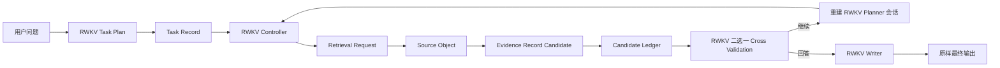

# Round 27：统一检索对象契约设计

## 1. 目标

Round 27 不以减少模块数量为目标，而以职责清晰、状态传递正确、RWKV 最终回答质量更高为目标。

本轮解决的是同一个系统性问题：用户要求的对象、RWKV 选择的检索对象、来源实际描述的对象、证据片段所属的记录以及最终 Writer 看到的记录，在现有链路中可能不是同一个对象。这个断裂会表现为：

- 把同一产品的旧版本当成当前版本；
- 把相关仓库当成目标仓库；
- 把不同公告中的 CVE、版本和修复状态拼成一条记录；
- 搜到了正确页面，但在最终上下文中只保留了错误记录；
- replan 不知道上一条路径的具体内容，再次生成等价查询；
- 代码、命令、YAML 或表格在清洗后失去结构。

所有修改必须满足：

1. RWKV 继续拥有任务拆解、工具选择、查询、是否继续检索以及最终答案。
2. 确定性代码只维护协议、对象身份、原文位置、状态和资源边界，不判断哪个事实为真。
3. 不根据测试题目、标准答案、实体白名单或关键词规则生成答案。
4. 最终输出保持 RWKV 原始输出，不删句、不改写、不补答案。

## 2. 唯一端到端契约



### 2.1 Task Record

Task Record 只来自 RWKV 的 Task Plan：

```json
{
  "task_record_id": "P1",
  "question": "用户要求的原子事实",
  "requested_subject": "RWKV 写出的目标主体",
  "requested_relation": "RWKV 写出的关系",
  "requested_fields": ["version", "build"],
  "time_scope": "current",
  "set_semantics": "single"
}
```

代码只验证结构，不从问题中补写主体、版本或答案。

对象作用域必须按 Task Record 计算。若用户目标同时出现多个显式对象，不能把完整目标中的所有对象复制到每个任务点，否则每个来源都会对多个任务点同时显示为“对象一致”。只有当整个计划只有一个显式对象，或计划只有一个任务点时，才允许把该对象作为未绑定请求的传输作用域；这仍不构成 Evidence 与 Task Record 的事实绑定。

### 2.2 Retrieval Request

每次工具请求都保留：

```json
{
  "tool": "connector_lookup",
  "arguments": {},
  "task_record_id": "P1",
  "requested_object": {},
  "request_id": "..."
}
```

`task_record_id` 仍允许 RWKV 省略。省略时结果进入未绑定候选区，不能被系统悄悄绑定到某个任务点。

但“未绑定”不等于“对象身份丢失”：

- 单任务点计划可以携带该任务点唯一的对象作用域，同时明确记录 `evidence_binding=false`；
- 多任务点计划只在全局恰好存在一个显式对象时携带该对象；
- 网页搜索阶段已经观察到的对象关系不能因为可选 `task_record_id` 为空而被结果包装层覆盖。

### 2.3 Source Object

Source Object 描述来源真实属于什么对象，而不是判断它是否回答了问题：

```json
{
  "source_object_id": "github:oven-sh/setup-bun",
  "source_object_type": "github_repository",
  "source_record_id": "release:v2.0.2",
  "source_url": "...",
  "provider": "github.rest"
}
```

结构化 API 使用 API 返回的稳定标识；普通网页使用规范化 URL 和页面内原文标签。这个字段只保留来源身份，不做“正确/错误”裁决。

### 2.4 Evidence Record Candidate

页面片段抽取器不再局部宣布 `exact_requested_record`。它只返回原文中能观察到的候选记录：

```json
{
  "supported": true,
  "task_record_ids": ["P1"],
  "field_keys": ["version", "build"],
  "source_subject": "Windows 11",
  "source_record_key": "25H2 / 26200.9168",
  "quote": "原文连续短引",
  "chunk_id": "chunk-7"
}
```

它可以说“这个片段与 P1 有关”，但不能在只看到一个 chunk 时说“它就是当前记录”。当前性、冲突和多记录关系必须在完整候选集合中由 RWKV 判断。

## 3. 各模块职责

### Task Plan

- RWKV 将问题拆成事实记录，而不是检索步骤。
- 同一原子记录的字段必须放在同一个 Task Record 内，避免版本、build、主题被拆散。
- 校验器只检查 JSON、ID 唯一性和字段类型。

### Retrieval Controller

- 执行 RWKV 的工具请求。
- 记录 request id、task record id、完整参数和执行结果。
- 阻止完全相同的已执行请求，但把具体旧路径显示给 RWKV。
- 不用词法相似度阻止 RWKV 新查询；增加年份、字段或范围的近似查询必须允许真实执行。
- 协议错误和无进展进入有界恢复，不直接替模型选择工具或查询。
- 同一 URL 被不同任务点重复使用时，保留每次 request id、task record id 和对象关系；合并正文时不能覆盖前一次 chunk candidate 或 provenance。
- Source 合并、Round 合并和 Ledger 合并都使用同一套集合语义：正文可选择更完整版本，但 `object_alignments`、`retrieval_requests`、`retrieval_bindings`、Task Record IDs 和 grounded spans 只能去重合并，不能由最后一次请求覆盖。
- 同一 grounded span 后续获得新的 Task Record 或精确对象绑定时，更新的是该 span 的 provenance；不能因为 evidence ID 相同而跳过新绑定。

### Structured Connector

- 使用一个一致的 `connector + operation` 词汇表。
- 对 `paper/papers`、`release/latest_release` 等输入在模型可见 schema 中使用唯一规范名。
- 从任意自然查询中安全提取 GitHub `owner/repo`，同时保留原始请求和解析结果供审计。
- connector 返回 Source Object 标识，不能把搜索结果中的第一个相关仓库无提示地当作目标仓库。
- crates.io、PyPI、npm 的当前发布记录优先通过各自公开结构化 API 返回版本与发布时间；只有 RWKV 选择对应 operation 时才执行，Controller 不根据题目自动路由。

### Page Evidence

- 只抽取原文候选记录、字段名、连续短引和 locator。
- 不做跨页面或跨版本的“最新/精确”判断。
- deterministic locator 只允许定位原文，不允许生成事实或替换最终答案。
- 当 RWKV 抄录了明确版本、日期或 CVE 标识，但 Markdown 表格/链接导致整句 quote 无法逐字匹配时，locator 只能回到包含全部模型所抄标识的单个原文行，并原样保留该行；不能生成新字段。
- 保留 `<pre>`、`<code>`、表格、换行、缩进和标点。
- Markdown 表格的每一条数据行会额外生成一个原文 `table_record` 窗口。代码不解释列、不选择“当前行”，只保证版本、build、日期等同一行 tuple 不被大 chunk 边界拆散。

### Candidate Ledger

- 保存每个 Task Record 下的全部有来源候选记录。
- 保存未绑定候选，不自动归属。
- 保存 Source Object、Source Record、字段、原文 span 和 provenance。
- 不再用 `exact_record_count` 作为事实完成判断；兼容字段只作为旧 Trace 读取边界。

### Cross Validation

- 使用与 Writer 相同的候选证据投影。
- RWKV 只做二选一：`continue_retrieval` 或 `write_answer`。
- Planner 请求结束、重复/无进展资源边界、协议资源边界和最大步数边界，全部通过同一个 `finalize_or_replan` 出口。
- 同一份证据与路由状态只复核一次；证据或完整请求路径发生变化后才允许再次复核。
- 如果继续，直接重建 RWKV Planner 会话；由 Replanner 自己选择任务点、工具、完整参数和查询，不再插入独立 Gap Focus。
- 最大步数边界上的 `continue_retrieval` 获得一个有界的三步窗口，使 RWKV 的复核决定能够真正执行，而不是被资源出口立即忽略。
- 确定性代码不根据关键词、日期或来源等级覆盖 RWKV 的选择。
- CV 缓存键包含 evidence revision 以及已执行/冻结的完整 `route_id` 集合。新增失败路径会触发一次新的 RWKV 判断；同一路径反复命中只累加 `blocked_count`，不会伪造新状态并反复调用 CV。

### Writer

- 按 Task Record 展示候选记录，而不是按网页轮询堆叠 chunk。
- 每个候选记录显示 Source Object、Source Record、日期、字段和原文短引。
- 不把任何候选标成系统判定的“正确”或“当前”。
- 明确要求 RWKV 在完整候选集合中比较记录身份后回答。
- Writer 输出原样返回。

## 4. Replan 状态修复

当前实现要求 RWKV 避开旧路径，却设置 `route_text_withheld_from_replan=true` 并删除查询文本。这是自相矛盾的。

Round 27 改为保留最近有界路径：

```json
{
  "route_history": [
    {
      "tool": "web_search",
      "query": "...",
      "task_record_id": "P1",
      "status": "ok",
      "completed": true,
      "frozen": true,
      "frozen_reason": "exact_duplicate_request"
    }
  ]
}
```

这不是为 RWKV 生成新查询，而是让它看到自己已执行过什么。

同一路径在状态中只出现一次。Planner 每一步都是一个独立 G1i 请求：`System: Tools`、一个权威 User 状态、一个新的 `Assistant: ```json` 生成边界。上一条 Assistant 调用和 Function output 只保留在审计 Trace，不重放到下一次模型请求，避免 RWKV 把已完成调用当作待续写文本。

请求级温度按职责区分：

- Planner：0.1；
- 二选一 Cross Validation：0.1；
- 普通恢复：0.4；
- CV 触发的 Replanner：0.8；
- 重复策略仍未改变时：最高 0.9。

温度只改变 RWKV 请求的探索程度，不生成 seed，不由代码替模型选择查询。

## 5. 上下文组织

最终上下文按 Task Record 分配预算：

1. 每个 Task Record 至少保留一个候选记录；
2. 同一记录的多个字段和相邻结构作为一个 tuple 保留；
3. 再加入同主体的其他版本/日期候选供 RWKV 比较；
4. 未绑定来源单独显示，不能伪装成已绑定证据；
5. 代码和表格使用原结构，不压平为单行。

候选排序可以使用确定性相关性、来源稳定标识和 RRF 等信号，但这些信号只决定抓取/上下文预算，不宣布事实真假。Provider 召回、融合候选池和实际抓取量是三个独立预算：每个 provider 默认召回 20 条，RRF 融合池保留 48 条，最终按对象/权威性/主题相关性优先、RRF 共识作为后置 tie-break，并按域名多样性抓取 8 页。关闭 RRF 审计事件不能关闭已经配置为 active 的 RRF 排序。

## 6. 实现顺序

1. 新增统一对象契约与审计字段。
2. 修复 connector schema、GitHub 目标解析和 Source Object 元数据。
3. 删除 page-local exact/current 决策，Ledger 改为候选记录语义。
4. 修复 HTML/code/table 结构保真。
5. 修复 replan 的具体路径、独立请求边界与权威状态投影。
6. 使用同证据投影上的极简 RWKV Cross Validation，并把所有合成出口统一到 `finalize_or_replan`；继续时直接重建 RWKV Planner。
7. 按 Task Record 重组 Writer 上下文，保持最终输出原样。
8. 完整单元测试、链路测试、真实 RWKV canary、服务器全量 100 题回归。

## 6.1 v7 Trace 暴露的额外断点与 v8 修复

Round 27 v7 的 12 题真实 Trace 显示：11 题的 RWKV 都省略了可选 `task_point_id`。搜索层已经找到正确对象后，统一结果包装层却用空 Task Record 再计算一次 alignment，擦除了前一层对象关系。v8 因此同时修复：

1. 单任务点的无 ID 请求仍保留唯一对象作用域，但不自动绑定证据；
2. 多对象目标不再形成 Task Record × Object 的错误笛卡尔积；
3. provider 已计算的对象关系不会被空作用域覆盖；
4. Planner 最近结果摘要显示 Source Object、Object Alignment、source subject 与 source record key；
5. 同 URL 的多次 task-scoped 提取会保留全部候选和请求绑定，不再由较长正文覆盖旧记录。

这些改动修复状态传递，不判断事实真假，也不修改 Writer 的模型输出。

## 6.2 完整链路审计后的统一修复

进一步逐层审计发现，同一对象仍可能在三个“重复合并”边界丢失：

1. 共享 Source 选择更长正文时会覆盖旧 `claim_ids`；
2. Claim Ledger 发现相同 evidence ID 时会直接跳过后续精确对象关系；
3. Round/Writer 合并相同 quote 时只保留第一次 Task Record 绑定。

当前实现统一为：

- Source 正文和 provenance 分开合并；
- 每个 Task Record 指向更新后的 canonical Source；
- Claim Ledger 对相同证据正文合并后续路由观察，并把这类变化计入 evidence revision；
- Planner、CV 和 Writer 都看到有界的复数 `object_alignments`、`retrieval_requests` 与 `retrieval_bindings`；
- Provider/model 完成顺序变化但证据集合未变时，不增加 evidence revision；
- 使用一条端到端测试验证 `Round merge → shared state → Claim Ledger → Planner memory → Writer context` 中精确对象关系不丢失。

## 7. 验证要求

必须新增并通过以下通用测试：

- `oven-sh/setup-bun` 不能静默变成 `oven-sh/bun`；
- paper connector 的模型可见名称和执行名称一致；
- `owner/repo latest release` 可以解析目标仓库但不会吞掉后缀自然语言；
- 多个历史记录不会在单 chunk 局部全部标成 exact/current；
- `<pre>`、代码、YAML、命令标点和表格行关系保持；
- replan 能看到上一条完整的有界路径；
- CV 和 Writer 使用同一证据投影；
- 最终模型输出字节级原样返回；
- 没有标准答案、数据集 ID 或实体专用规则进入运行时代码。

当前本地完整工程回归：`488 passed, 3 subtests passed`。该结果只证明工程契约和历史行为没有回归；真实答案质量仍必须通过服务器上的同题 RWKV 全链路实验比较。

完成局部验证后，必须在服务器使用相同 100 题、4 并发、50 steps 做 Round 27，并按“最早失效层”逐题和 Round 26/Round 25 历史结果比较。
