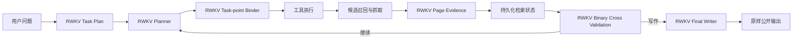

# Round 31：质量优先的检索链路职责设计

## 目标

本轮不是以减少模块、调用次数或延迟为目标，而是修复 Round 30 全量 Trace 中已经反复出现的质量损失。任何新增边界都不能替代 RWKV 判断事实，也不能修改 RWKV 的最终文本。

## 模块职责

- Task Plan：只拆用户要求的事实记录，不生成检索步骤或答案。
- Planner：决定工具、operation、query、URL 和停止时机。
- Task-point Binder：仅在多记录任务中，为 Planner 已经生成且不可改写的检索调用选择一个现有任务点 ID。
- 工具/检索层：执行调用、并发召回、抓取、清洗和分块，不判断答案。
- RRF：保留影子统计用于消融，不再主动改变抓取顺序；Round 30 的主动 RRF 使正确官方页面被替换。
- Page Evidence：由 RWKV 从原始 chunk 中选择候选 span；确定性代码只定位逐字一致的 span。若 quote 仅因 Markdown 链接地址或显示符而无法在原文直接定位，可在定位器内部使用可见文本投影做精确匹配并映射回原文；该投影不进入模型提示词。不允许摘要、模糊匹配或事实改写。
- 状态层：保存完整 request identity、证据 revision、失败和冻结路径。Planner 每次只看到一份权威 route history。
- Cross Validation：在与 Writer 完全相同的完整证据包上做 `continue_retrieval` / `write_answer` 二选一。
- Writer：RWKV 独立生成公开答案。输出只使用角色边界 stop 防止进入下一轮协议，不做删句、改写、补答案或规则拒答。

## Round 30 证据

- 100/100 有最终输出，但冻结标准人工语义均分仅 41.85；工程完整不等于回答正确。
- 941 个 Planner 路由决策中只有 4 个携带任务点 ID。
- recovery/replan 中存在重复旧路径表示，Planner 大量复用完全相同的 action 和 arguments。
- RRF 新增页面进入 Writer 后，配对样本改善与退化数量相同，且均值下降。
- 多题中正确记录已经进入 Writer，但最终选择旧记录或拼接不同记录。
- 额外 Evidence Selector 的冻结页 A/B 没有提高质量，并会删除已经进入证据包的正确记录，因此未晋级为正式架构。
- Round 30 有 216 条 RWKV 正向 quote 被 source boundary 拒绝。生产 locator 回放确认其中 26 条、覆盖 20 个题目，只因 Markdown 展示语法而无法逐字映射；模糊匹配虽然可放行更多文本，但会把实质性错词和模型改写伪装为原文，禁止使用。

## 禁止边界

以下信息不得进入运行时：标准答案、人工评分、历史 pass/no-pass、题目专用关键词或预期 URL。控制器不得根据日期、版本、关键词、域名或相似度替 RWKV 选择事实；不得改写最终答案。

## 下一轮验证

1. 使用 `uv` 完成针对性和全套测试。
2. 回放 Round 30 被拒 quote，确认只恢复 Markdown 可见文本逐字一致的 span，实质性改写继续拒绝。
3. 同一冻结 100 题、4 并发、相同资源上限执行 Round 31。
4. 逐题人工语义评分，并按最早可观察疑点读完整 Trace。
5. 与 Round 17/25/29/30 使用同一阈值比较；未达到历史最好不上传 GitHub。
