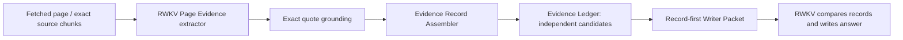

# Round 32：页面级 Evidence Record Assembler

## 问题定义

Round 31 v2 证明 Markdown quote locator 不是当前主要质量上限。Fortnite、Warframe、Bun、Python、Chrome、Ubuntu 的正确值已经进入抓取正文、候选集合或 Writer 包，但同一页面的不同版本、日期和字段仍会被重新合并，RWKV 最终只能从一个混合来源块中猜测字段归属。

当前实现存在一个直接矛盾：`agent/retrieval_synthesis.py::_source_identity()` 的注释声明 `record_key` 为空时应保留独立候选，实际代码却返回 `source-object-task:{source_object_id}:{task_record_ids}`，随后 `_merge_source_records()` 把这些 span 合并。即使 Claim Ledger 中的 `EvidenceRecord` 是独立的，Writer Packet 仍会丢失原子性。

Round 30 全100题后验统计：

| 风险信号 | 题数 | 当前人工均分 |
|---|---:|---:|
| 同一 source object/task 下有多个记录，且至少一个 `record_key` 为空 | 73 | 56.458 |
| Writer 中身份未解析的来源块包含多个 packed chunks | 64 | 55.000 |
| Writer 同一来源块包含多个日期或版本 marker | 41 | 48.875 |

完整影响面见 `outputs/round31_quality_review_20260814/ROUND30_RECORD_ASSEMBLY_IMPACT.md`。这些只是结构风险信号，不直接证明某个答案错误。

## 单一结构变量

Round 32 只改变 **Page Evidence 到 Writer Packet 之间的候选记录原子性**：



不改变：

- 搜索 provider、RRF、抓取顺序和 fetch 数量；
- Task Plan、Planner、replan、Cross Validation；
- Page Evidence 的 `supported` 判断和模型输入；
- 温度、采样、stop、max token；
- RWKV Writer 的判断任务和回答要求（只同步新的候选块名称与边界说明）；
- RWKV 最终输出及其公开方式。

因此本轮不能修复“正确结构窗口被 Page Evidence 返回 `supported=false`”的 Fortnite/pg_dump 类问题；该问题作为后续独立变量处理。

## 模块职责

### RWKV Page Evidence

仍负责：

- 判断一个模型可见窗口是否与任务相关；
- 选择一个连续 source quote；
- 给出 task point、field keys、source subject 和 literal record key。

Assembler 不推翻 `supported=false`，也不根据答案标准补记录。

### Exact Quote Grounding

仍只验证模型 quote 能否映射回抓取正文，得到原始 `char_start/char_end`。不做相似度放行或事实纠正。

### Evidence Record Assembler

新增单一职责：把已经 grounded 的 source span 组织成不可混淆的候选记录。

规则：

1. 一个 grounded candidate 默认对应一个 Evidence Record。
2. `record_key` 为空时，记录身份使用 opaque `record_span_id`，由 `source_object_id + source locator + quote digest` 生成；它不是事实标签。同一物理 span 可保留多个 RWKV task-point/field binding。
3. 不同 `record_span_id` 永不因为 URL/task point 相同而合并。
4. 只有 `source_object_id + literal record_key` 相同，才允许把不同字段 span 放在同一候选记录中；task-point binding 作为该物理记录的多值路由元数据保留。
5. 本轮不自动拆分一个 grounded quote；一个模型候选对应一个原始连续 quote，避免引入新的结构解释器。
6. inherited `field_keys`、task point 和 subject 仅保留 RWKV 已输出的标签；代码不能新增语义绑定。

建议状态形状：

```json
{
  "evidence_record_id": "E-...",
  "record_span_id": "SPAN-...",
  "parent_candidate_id": "C-...",
  "task_record_id": "P1",
  "source_object_id": "url:https://...",
  "record_key": "",
  "field_keys": ["版本号", "发布日期"],
  "quote": "原始连续行",
  "source_locator": {
    "chunk_id": "chunk-2",
    "char_start": 100,
    "char_end": 180
  },
  "assembly_basis": "single_grounded_span"
}
```

`record_span_id` 只用于避免错误合并，不展示为事实，不参与“当前/正确”判断。

`record_span_id`、`parent_candidate_id` 和重复的 task/field transport 字段保留在 Ledger、Trace 与前端审计对象中，不进入 Writer 正文。Writer 中只保留一次 task-point binding、一次 span field binding、必要的可观察对象身份以及原始 quote，避免把状态键当成事实并浪费上下文。

### Record-first Writer Packet

Writer Packet 应以候选记录为第一层，而不是以 URL 为第一层：

```text
[R1] Candidate record
Task point: P1
Source: ...
Literal record key: ... / unresolved
Exact source span: ...

[R2] Candidate record
...
```

相同 URL 可以出现多个 `[R#]`。这样 RWKV 能明确看到“这些是竞争记录”，而不是把它们理解成同一个记录的多个字段。

上下文预算仍按现有 task-point round-robin 和总 token budget执行；本轮不新增日期优先、官方白名单、规则真值排序或答案门禁。旧的 `context_source_count=8` 以“页面块”为单位，不能机械套到拆分后的原子 span；生产默认允许最多24个候选记录参与精确 token packing，总输入仍受原有约6K evidence token budget限制。显式实验参数仍可覆盖该上限，fallback页面仍保持独立小额度。

## 禁止行为

- 不读取 case ID、gold/reference、人工分数或历史 pass/no-pass。
- 不根据版本号大小、日期大小、域名、关键词或相似度选择正确记录。
- 不把 `supported=false` 改成 true。
- 不把多个来源拼成一个“完整事实”。
- 不修改、补写、删减或拒绝 RWKV 最终答案。
- 不为 Fortnite、Python、Chrome、Ubuntu 等题目添加专用规则。

## 验证顺序

1. 单元测试：同URL/同task但空 `record_key` 的记录必须保持分离；相同 literal key 才能合并；坐标与quote必须完全可逆。
2. Frozen packet replay：用 Round 30 Claim Ledger 重建100题的候选 packet，不调用模型，记录 source block 数、混合marker率和context token变化。
3. 12题canary：保持Round 31 v2其他变量不变，4并发运行。
4. 逐题人工配对：重点检查 NASA、Warframe、Bun、Python、Chrome、Ubuntu；pg_dump/Fortnite预计不因本轮变量改善，但不得回退。
5. 只有 canary 显示记录混合率下降且答案无类别回退，才运行全100题。

## 晋级判断

Round 32 canary 必须同时满足：

- 12/12 有RWKV最终输出，0工程错误；
- `record_key` 为空的多个 span 不再合成一个 Writer block；
- 同一 Writer evidence record 的多日期/多版本 marker 数显著下降；
- Mamba、GitHub OIDC保持正确；
- pg_dump/Fortnite不得因上下文挤压进一步回退；
- 当前事实均分高于 Round 31 v2 的42.92；
- 标准答案未进入任何运行时文件或模型输入。

未满足时撤回本轮实现，不运行100题。

## Frozen packet replay 结果

完整记录见 `outputs/round31_quality_review_20260814/ROUND32_FROZEN_PACKET_REPLAY.md`。100题实际归档包对比结果：身份未解析且包含多个chunk的候选块由126降为0；候选块多日期/多版本marker由59降为3；task-point coverage保持108；平均evidence context为4582 tokens，最大5997；独立quote总数835增至986。该结果只允许Round 32进入真实RWKV canary，不代表答案已经提升。
