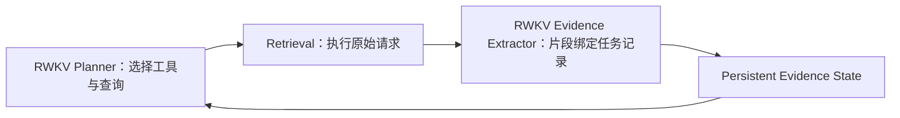

# Round 34：多任务点检索保持无绑定

## 已证实问题

Round 32/33 的全部多任务点样本都出现同一现象：Planner 的原始函数调用没有 `task_point_id`，随后独立低温 RWKV Binder 把每条检索都绑定到 P1。该绑定进一步收窄 Web Evidence Focus，导致 P2/P3 长期没有候选记录并触发重复路径。

## 唯一语义变量

删除“多任务点缺少 id 时再调用一次 RWKV 单选 Binder”的路径：

- Planner 明确输出合法 id：保留；
- 计划只有一个任务点：结构性绑定该唯一 id；
- 计划有多个任务点，Planner 未输出合法 id：保持 unbound。

Unbound 不等于丢弃任务结构。Web Evidence Extractor 接收完整用户问题和全部任务记录，由 RWKV 对真实页面短引输出 `task_record_ids` 与 `field_keys`。

## 不改变

- Task Plan 生成；
- RWKV 的工具、query、operation、arguments；
- Retrieval provider、RRF、fetch、page cleaning；
- Evidence Record Assembler；
- Cross Validation、Writer、最终答案；
- 各阶段采样参数、step/resource 边界；
- request identity 计算。

## 职责边界

Controller 不再调用第二个模型替 Planner 的同一请求选择“主要任务点”。

## 预期机制

- 多点页面提取不再被错误 P1 Focus 收窄；
- 同页包含的 P2/P3 字段可由 RWKV extractor 同时记录；
- Planner 下一轮能看到不同任务点的真实候选记录进度；
- 少一次 Binder 请求，减少对枚举首项的采样偏置；
- 不以规则判断事实、不修改 RWKV 最终答案。
