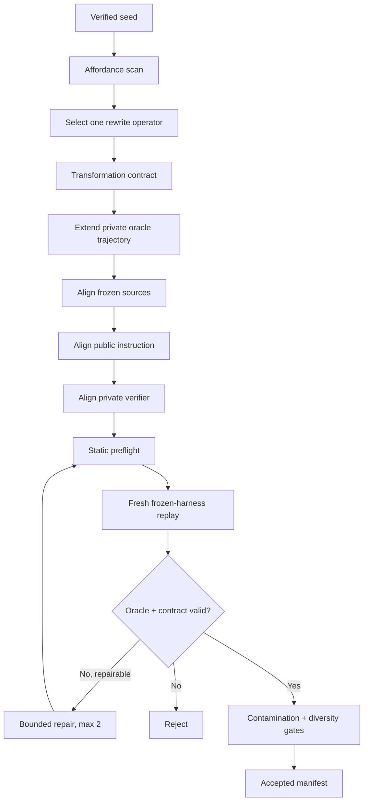

# RWKV 检索 Agent 递归数据合成方案

> 当前目录是与在线检索运行时隔离的数据工厂实验区。运行时不会导入这里的模块，当前数据也不会自动进入训练。

## 当前状态

- `pilot_v1/`：5 个用于验证数据包协议的手工 pilot。
- `bootstrap_v1/`：20 个虚构、可复现、无实时网络依赖的 bootstrap 任务。
- 20/20 bootstrap 通过 oracle、contract、证据 span、公开/私有隔离和评测污染检查。
- 当前导出：20 条成功轨迹、88 条阶段 SFT、20 组偏好对、20 条 verifier-RL 任务。
- 所有实体、日期、版本和 URL 都是虚构值，URL 使用 `.invalid`；没有使用评测题标准答案。

这只是数据工厂的可用性验证，不代表 20 条模板数据已经足够训练模型，也不代表已经完成真正的递归扩展。

## 为什么仅靠架构还不够

当前检索链路已经能约束工具、保存证据和重新规划，但真实轨迹仍暴露出一组模型行为缺陷：

| 缺陷 | 典型表现 | 主要解决手段 |
|---|---|---|
| 协议不稳定 | Cross-validation 输出缺字段、JSON 解析失败 | 阶段 SFT + 协议错误偏好对 |
| 时间角色混淆 | 把首次公开、上线、周年活动、当前版本日期互相替代 | 多字段 fact-binding 数据 |
| 当前与历史混淆 | 使用更旧但关键词更强的版本页面 | 新旧来源冲突与 freshness 数据 |
| 来源角色幻觉 | 把社区教程称为官方文档 | authority 对比与负样本 |
| 伪造验证经历 | 输出“已在某版本测试”但证据没有说明 | epistemic-language 偏好数据 |
| 直接 URL 过度搜索 | 已给目标页面仍扩展到开放网页 | direct-page 成功轨迹与动作偏好 |
| Replan 不改变策略 | 重复等价查询，页面越来越多但字段仍缺失 | strategy-changing replan 轨迹 |
| 最终答案自相矛盾 | 标题、列表和正文给出不同日期或版本 | final consistency 偏好数据 |
| 上下文交接失真 | 原始页面已有答案，最终上下文却遗漏或绑定错误 | claim-scoped context 与 span 绑定 |
| 复读与长输出退化 | `<think>` 或格式片段循环直到输出上限 | 短阶段目标、终止边界和复读负样本 |

确定性代码仍负责网络、状态、作用域、日期计算和原始 span 校验；训练负责让 RWKV 学会语义角色、来源边界、协议、停止、Replan 和一致表达。不能让确定性规则改写 RWKV 的最终答案。

## 论文方法如何迁移到检索任务

[Recursive Synthesis for Long-Horizon Terminal Tasks](https://arxiv.org/html/2608.05466v1) 从 639 个已验证 seed 出发，在 15 轮中得到 37,484 个任务。可迁移的核心不是终端命令本身，而是以下原则：

1. 每个 seed 都有可执行的私有 oracle。
2. 先定义 transformation contract，再扩展任务。
3. solution、verifier、instruction、environment 必须对齐。
4. 同时满足 oracle validity 与 contract validity 才能接收。
5. 静态检查后在全新环境验证，失败最多进行两次受限修复。
6. verifier 检查结果与语义状态，不绑定唯一动作序列。
7. 对父任务、领域、operator 和相似样本设置多样性上限。
8. 使用规范化 13-token 重叠和 5-gram Jaccard 检查评测污染。

检索任务把“终端 workspace”替换成“冻结的检索环境”，把 `solve.sh` 替换成“Planner → Tool → Evidence → Cross-validation → Final”的 oracle 轨迹。



## 数据包边界

每个任务目录包含：

```text
task.json
instruction.md
environment/
  sources.jsonl
private/
  contract.json
  oracle_trajectory.json
  reference_answer.md
```

模型 rollout 只能看到：

- 用户指令；
- 冻结的工具接口；
- 工具调用后返回的 `sources.jsonl` 对应内容；
- 当前阶段允许看到的共享状态。

模型绝不能看到：

- reference answer；
- 私有 claim 期望值；
- oracle Task Graph 或动作序列；
- verifier 的完整检查清单；
- 评测题标准答案。

私有 contract 的每个正向 claim 至少包含：

```text
claim_id
point_id
field
expected
evidence_refs
exact quotes
required
optional deterministic derivation
```

这套 contract 只用于数据验收和训练奖励，不进入在线 Agent 的最终答案改写链路。

## Operator taxonomy

当前先保留五个 family、十二个 operator：

1. 任务与时间拆解
   - 历史/当前角色分离
   - 确定性日期派生
2. 检索与来源选择
   - 旧来源冲突
   - 缺少官方教程
   - 指定 URL 范围
3. 证据与上下文
   - 导航噪声
   - 上下文预算压力
4. 协议与恢复
   - Cross-validation 协议修复
   - 真正改变策略的 Replan
5. 最终答案落地
   - 来源角色陷阱
   - 内部一致性
   - 部分证据与校准表达

后续每次递归只选择一个主 operator，避免一次变化太多而无法定位收益来源。

## 验收门禁

一个候选任务必须全部满足：

1. **Oracle validity**：私有参考轨迹从初始冻结环境出发能完成任务。
2. **Contract validity**：verifier 检查的要求都在公开指令中说明，或能从冻结来源自然发现。
3. **Source grounding**：每个 sourced fact 的 quote 必须原样存在于指定来源。
4. **Derivation validity**：派生事实必须由日期计算器等确定性 harness 重放成功。
5. **Fact binding**：Cross-validation 必须输出 `field/value/evidence_ref/quote`。
6. **Action scope**：direct-page 任务不能偷偷使用开放搜索。
7. **Anti-shortcut**：拒绝硬编码答案、伪造来源角色、伪造测试经历和空占位答案。
8. **Private isolation**：公开文件不得出现私有答案、oracle 或 verifier 路径。
9. **Contamination**：与冻结评测集出现规范化 13-token 精确重叠则拒绝；5-gram 相似度过高则告警。
10. **Diversity**：限制单 parent、domain、family 和 operator 的接收数量。

可恢复失败最多修复两次；修复不能削弱语义检查、删除 anti-shortcut 条件或把私有答案写入公开指令。

## 四条训练数据通道

### 1. Stage SFT

分别训练：

- Planner 输出完整 Task Points；
- Tool selection 选择查询、URL 和来源策略；
- Evidence Extractor 输出短、严格、带 span 的结构；
- Cross-validation 输出缺失字段、冲突和 answer-ready fact；
- Replan 改变检索策略；
- Final Writer 只使用已绑定事实完成回答。

阶段样本比超长整轨迹更适合当前 16K RWKV。

### 2. Successful trajectory SFT

只把 oracle-valid 或真实 verifier-passed 轨迹作为正向监督。System、User、Tool result 和失败尝试的 `loss_mask=false`；只训练成功的 assistant 动作和最终输出。

### 3. Preference data

把真实失败作为 rejected，把同一输入下的合格输出作为 chosen，重点覆盖：

- 格式不完整；
- 时间角色混淆；
- 旧版本误判；
- 来源角色幻觉；
- 伪造“已测试”；
- 重复等价查询；
- 最终答案内部冲突；
- 有部分证据却完全空答。

失败轨迹不能作为普通 SFT 正样本。

### 4. Verifier RL

任务侧只提供公开指令和冻结来源；私有 contract 产生分项 reward：字段覆盖、来源绑定、时效性、冲突处理、工具效率、协议正确性和最终一致性。Reward 评估结果，不要求模型复现 oracle 的固定查询顺序。

## RWKV 16K 上下文策略

不直接照搬论文中面向其他模型的超长上下文训练配置。

- Planner 样本：约 1.5K–3K 输入。
- Evidence 样本：单 chunk 约 1.5K–2.5K，目标输出 256–768 tokens。
- Cross-validation：约 2.5K–5K，只包含 Task Points、Ledger 投影和每点少量证据。
- Replan：失败摘要 + 缺失字段 + 已尝试策略，不传完整历史。
- Final：约 6K–10K 输入，保留充足输出空间。
- 训练覆盖 2K/4K/8K/12K/16K 多个长度桶，答案 span 在上下文前、中、后部均匀分布。
- 超长轨迹按阶段和状态快照切分，而不是把所有网页、events 和 planner transcript 一次塞入。

## Request-level temperature 数据策略

Temperature 是 rollout 元数据和运行时策略，不作为答案文本的一部分。先做小网格实验，不机械固定为一个值：

| 阶段 | 首轮实验候选 |
|---|---|
| Evidence / strict JSON | 0.05、0.10 |
| Planner | 0.10、0.15 |
| Cross-validation | 0.05、0.10 |
| 首次 Final | 0.05、0.10 |
| 重复策略失败后的 Replan | 0.10、0.20、0.30 |

每条 rollout 记录 `request_stage / temperature / seed / result / protocol_valid / verifier_reward / repetition_metrics`。只有 Replan 在重复策略失败后允许升温；不能为了不同输出而无条件提高所有阶段温度。当前约束下不同时修改其他解码参数。

## 建议扩展顺序

### Phase A：Bootstrap

- 先构建 300–600 个经人工或强 verifier 审核的 seed。
- 领域覆盖软件文档、游戏版本、公告、论文、GitHub、社区教程、天气/结构化数据、指定 URL 和多事实历史问题。
- 真实实体可用于来源结构研究，但训练值优先做可验证的虚构化，避免记忆评测答案。

### Phase B：Recursive rounds

- R1 目标约 2K accepted；R2 约 5K；R3 约 10K。
- 不强制复制论文的 15 轮；当 oracle yield、任务多样性或 verifier 可靠性下降时停止。
- 每轮保存 parent、operator、repair_count、所有 hash 和拒绝原因。

### Phase C：真实 RWKV rollout

- 在冻结任务上让 RWKV 自己规划、选工具、Cross-validate、Replan 和作答。
- 成功轨迹进入 trajectory SFT。
- 失败轨迹按 failure class 进入 preference 候选池。
- 网络错误与模型能力错误分开记录，网络错误不能成为训练负样本。

### Phase D：训练与回归

- 先做小规模 adapter/checkpoint 实验，验证协议成功率、unsupported claim、内部冲突和重复查询是否改善。
- 再运行冻结的 100 题、40 干扰题和完整真实 E2E；不能只看合成任务 reward。
- 只有跨集合改善且没有明显回归，才扩大数据量。

## 反作弊边界

- 数据生成前冻结评测文件和 SHA256。
- 生成器只读取评测题文本做污染扫描，不读取或构造评测标准答案。
- 不把真实评测 Task Graph、查询路径、答案字段或题目专属规则写入训练数据。
- 合成任务使用不同实体、值、措辞和来源结构。
- 最终报告同时给出 exact overlap、5-gram similarity、parent/operator 分布和拒绝原因。
- 真实 E2E 仍然只给用户问题、workspace 和工具，不能给答案、Task Graph 或 Replan 路径。

## 当前命令

全部使用 `uv`：

```bash
uv run python scripts/build_retrieval_rst_pilot.py --replace
uv run python scripts/build_retrieval_rst_bootstrap.py --replace
uv run python scripts/validate_retrieval_rst.py \
  training/retrieval_rst/bootstrap_v1/tasks \
  --report-dir training/retrieval_rst/bootstrap_v1/validation \
  --export-dir training/retrieval_rst/bootstrap_v1/exports
uv run pytest -q tests/test_retrieval_training_factory.py
```

后续分离成独立项目时，应整体迁移数据工厂、schema、operator cards、验证器、测试和文档；不要迁移 RWKV-ECRA 在线运行时或现有评测答案。
